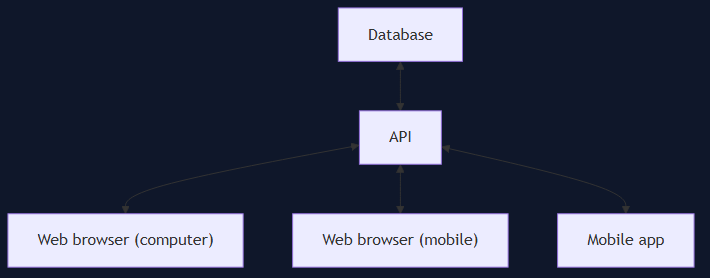

# Solution Structure

## Overview

LifePilot uses a client–server layout: clients talk to a single **API**, and the API reads and writes the **Database**. All connections are request/response (bidirectional in the diagram below).

| Component | Role |
|-----------|------|
| Database | Persistent storage for app data |
| API | Backend services, business logic, and authorization |
| Web browser (computer) | Desktop web UI |
| Web browser (mobile) | Mobile web UI (responsive or PWA) |
| Mobile app | Native or hybrid mobile client |

## Data flow

1. A client (web or mobile app) sends a request to the **API**.
2. The **API** validates the request, applies domain logic, and queries or updates the **Database** as needed.
3. The **API** returns a response to the same client.

The same API serves every client; platform-specific behavior stays in the client layer (UI, device APIs), not in separate backends.
